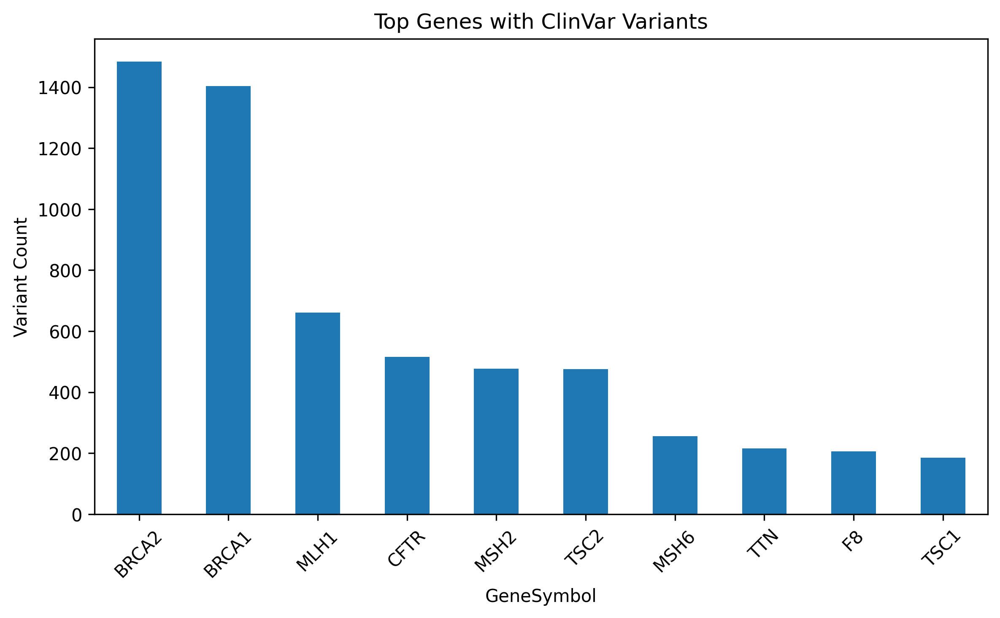
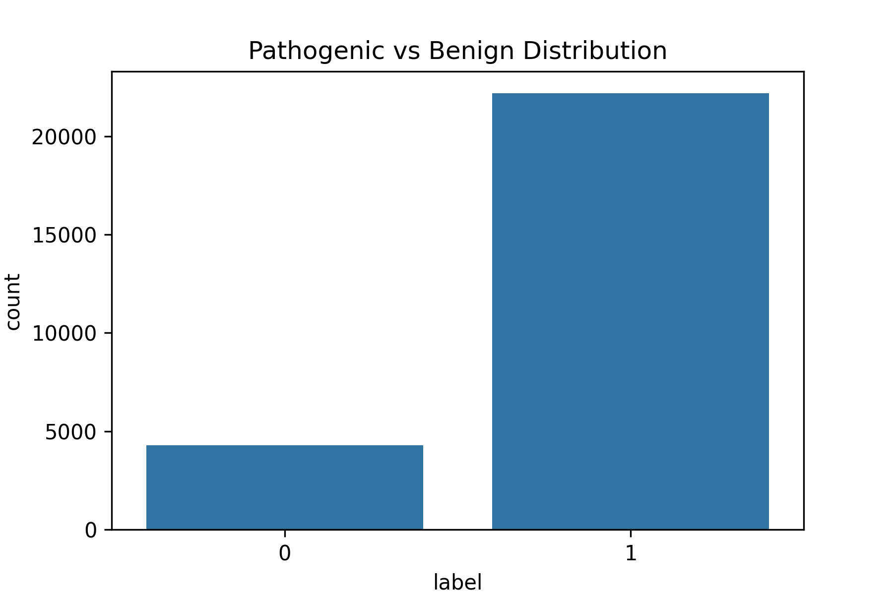

# ClinVar Variant Characterization
## Overview

This project explores clinically annotated variants from the NCBI ClinVar database. The goal was to examine the distribution of pathogenic and benign variants, assess gene-level burden, and evaluate the level of evidence supporting variant classifications.

The dataset was obtained directly from the official ClinVar release (variant_summary.txt.gz).

# Methods

- Filtered for human variants (GRCh38)

- Retained high-confidence clinical labels:

  - Pathogenic

  - Likely pathogenic

  - Benign

  - Likely benign

- Generated a binary pathogenicity label

- Examined gene-level variant counts

- Assessed review status as a proxy for evidentiary strength

# Key Findings

- A substantial number of variants fall under “no assertion criteria provided,” reflecting heterogeneous submission standards.

- Many variants are supported by multiple submitters without conflicts.

- A smaller but important subset has been reviewed by expert panels, representing higher-confidence classifications.

- Gene-level analysis highlights uneven distribution of clinically reported variants across genes.

# Figures
Top Genes by Variant Count

Pathogenic vs Benign Distribution

# Interpretation

ClinVar classifications vary in evidentiary strength depending on review status. Therefore, interpretation of pathogenicity should consider curation level alongside clinical significance labels.

This project demonstrates basic variant filtering, gene-level summarization, and quality-aware interpretation of public genomic data.

# Tools

- Python

- pandas

- matplotlib

- seaborn
